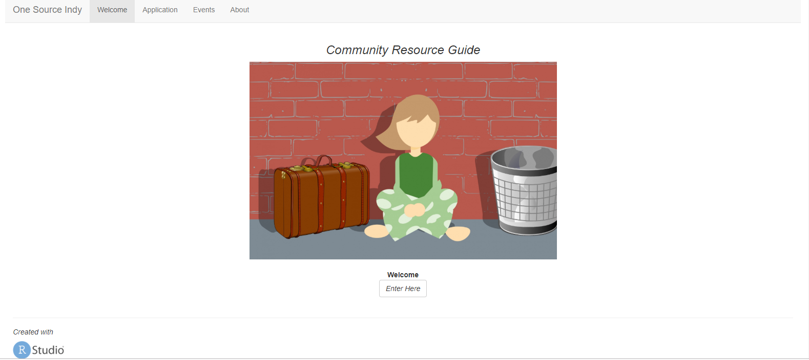

### Volunteer Project Info:
https://www.onesourceindy.org/

### Shiny App:
https://parmsam.shinyapps.io/one_source_indy/

### Quick info:
This R program uses social services data to create an open source app intended to better inform in-need homeless or unstably-housed individuals  living in Indianapolis on what is available in our communities. App code is in the prototype folder. 

Also included is a web scraping program that was used to pull Chip Indy Handbook for Help Data (http://www.handbookofhelp.org/)
### Goal:
To improve connection to care and health of homeless community members through better access to resource information.

#### Main page picture source: https://publicdomainpictures.net/en/view-image.php?image=293256&picture=homeless-people
#### Programs:
`deployed` folder - Files on shinyapps.io web app
